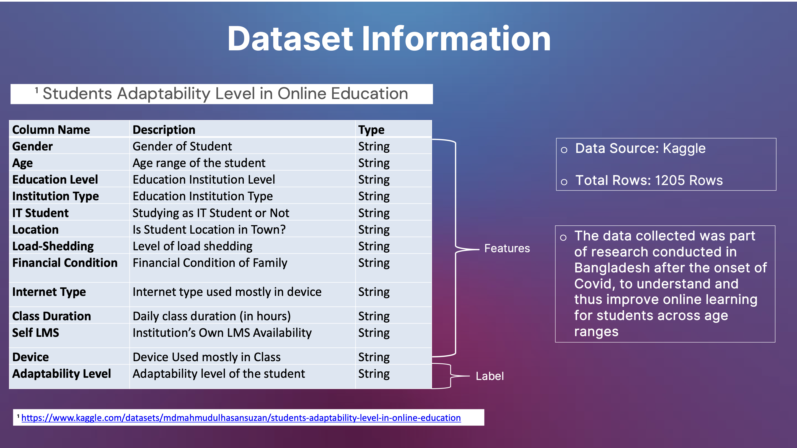

# Topic: Predicting-Student-Adaptability-Levels-in-Online-Education

**Group Members**
Rajeshwari Radharkrishna | Kelly Blake | Aisha Henderson | Sujatha Angajala

**Background**

In late 2019 and 2020, as the covid virus quickly became a pandemic, many across the world were forced to adjust to a "new normal" of social distancing, and schools were no exception. People had to find new ways to teach and learn, and one viable solution was online education. The dataset used for this machine learning project is part of research conducted in Bangladesh, and it's important information as it helps us understand the impact that demographic and economic features can have on adapting to online learning. It's not just about students; even adults had to adjust to remote work and online learning. 

**Project Description**

The purpose of this project is to utilize supervised machine learning methods to develop a model that can predict the level of student adaptability based on various demographic and socioeconomic features. Through the assessment of the predictive model, we can determine which factors impact/contribute to student adaptability in online learning with a goal of using this information to tailor programs and improve outcomes for new and existing digital learners.

**Dataset**
1.	Students Adaptability Level in Online Education (Effectiveness of Online Education)

        • Source: Kaggle

        • Link(s): https://www.kaggle.com/datasets/mdmahmudulhasansuzan/students-adaptability-level-in-online-education

**Tableau Visualizations**

You can explore the Tableau visualization of this project at the following link:

https://public.tableau.com/app/profile/rajeshwari.radhakrishna8250/viz/StudentsAdaptabilityLevelinOnlineEducation_16973378072580/Story1

**Coding and Machine Learning Tools Utilized**

- PostgresSQL
- Python Pandas
- SciKit Learn - Random Forest Algorithm
- Tableau Visualization

## Machine Learning Model and Coding Process

**Machine Learning Model**

Our model was trained using the Random Forest Algorithm to address the classification problem of predicting adaptability levels for students.

The y-value from the dataset that was used in the prediction was the `Adaptability` column, which contained multiple class labels of:
    - High
    - Moderate
    - Low

**Coding Process**

Step 1: Load the data from the SQL database and create a dataframe

    A. This was done by creating a function that connects to our database. 

    B. The function was then used to read the data into a dataframe

Step 2: Drop unnecessary columns (features) from the dataframe.

    A. The columns for `network_type` and `student_id` were dropped as they were unnecessary for the predictive model and analysis

Step 3: Determine Value Counts for remaining features

    A. The `value_counts()` function was used to determine the distribution of values for each feature. This information was necessary for the analysis of our model.

    Based on analysis of the value counts for each feature, we found that some of the features were imbalanced. While these features were not removed from our training and testing data, we accounted for this in our analysis of the model and interpretation of the predictions. This is visualized in the Tableau Story linked above.

    Additionally, because of the imbalance of some of the features, we did not code for or conduct analysis of 'feature importance', as it would not produce balanced results for the data. 

Step 4: Encoding Categorical Variables

    A. The `get_dummies()` function was used to convert categorical variables into a numerical format for the machine learning model

Step 5: Separate Features Train and Test Sets

    A. The features data was split into train and test sets

Step 6: Scale data using Standard Scaler

Step 7: Initialize and Fit the Random Forest Model

    A. Trained the model with specific n_estimators and a random_state

    B. Fit the model using our scaled data and y_train labels

Step 8: Evaluate the Model

    A. A confusion matrix and classification report were generated to determine the accuracy of the model predictions

*At this stage in training our model, we determined that there was a significant imbalance in the y-label, as there were only 22 occurrences of the 'High' adaptability label. We determined that due to the imbalance, RandomOverSampler method would be needed to balance and make new predictions with resampled data.*

Step 9: Use Random Over Sampler technique to Balance and Resample the Data

Step 10: Make new predictions using the Random Forest Algorithm

    A. A new Random Forest Model was initalized and fit with the resampled balanced data 

Step 11: Evaluate the final model 

    A. A new Confusion Matrix and Classification Report was generated to determine model accuracy. 

    B. Analysis of both models (before and after balancing the data) can be found in the next section.

## Data Analysis -- `before` Balancing the Data
*This analysis is based on the imbalanced data, before Random Over Sampler was utilized to balance and resample the data for the Random Forest Algorithm.*

1. CONFUSION MATRIX 

    

    The confusion matrix is a 3x3 matrix consisting of three classes...moderate, low and
    high. Each cell in the matrix represents the counts of instances falling into specific 
    categories. Here's the breakdown of the confusion matrix:

    In the first row:
        - 17 instances were correctly predicted as moderate.
        -  0 instances were incorrectly predicted as low.
        -  5 instances were incorrectly predicted as high.

    In the second row:
        - 2 instances were incorrectly predicted as moderate.
        - 105 instances were correctly predicted as low.
        - 12 instances were incorrectly predicted as high.

        In the third row:
        - 1 instance was incorrectly predicted as moderate.
        - 10 instances were incorrectly predicted as low.
        - 150 instances were correctly predicted as high.

    By utilizing the above-referenced confusion matrix, we were able to determine our 
    models’ overall accuracy.

2. CLASSIFICATION REPORT

    
    
    The classification report above shows the precision, recall, and accuracy for the *High*, *Moderate*, and *Low* classes. 
    
    The Precision is showing the ratio of correctly predicted positive observations to the total predicted positive observations. 
        
        - For the 'High' category, precision is at 85%, which shows that the model is correctly predicting positive observations in this class 85% of the time.

        - For the 'Moderate' category, precision is at 91%, which shows that the model is correctly predicting positive observations in this class 91% of the time.

        - For the 'Low' category, precision is at 90%, which shows that the model is correctly predicting positive observations in this class 90% of the time. 

    The Recall indicates the accuracy of correctly predicted positive observations to all predicted observations for that class (True Positives).

        - For the 'High' category, recall is at 77%, indicating that the model is correctly identifying 77% of this adaptability class.

        - For the 'Moderate' category, recall is at 88%, indicating that the model is correctly identifying 88% of this adaptability class.

        - For the 'Low' category, recall is at 93%, indicating that the model is correctly identifying 93% of this adaptability class.

    The Accuracy score indicates how often the model is correct, meaning the ratio of correctly predicted observations to the total number of observations.

        - For the model, the overall accuracy shows that 90% of the time, student adaptability is classified correctly. 

## Data Analysis -- `after` RandomOverSampler

1. CONFUSION MATRIX - `FINAL`

    
    
    After resampling the data, the Confusion Matrix is as follows:

    The below confusion matrix represents the performance of a classification model that predicts student adaptability into three classes: "High", "Low" and "Moderate". 
 
    These values are calculated based on the elements of the confusion matrix, 

        - For "High" adaptability, the model correctly predicted "High" adaptability 161 times with no false positives or false negatives, resulting in a perfect prediction rate for this category.
        
        - For "Low" adaptability, the model demonstrated strong performance with 121 true positives, 10 false positives, and 9 false negatives.

        - For "Moderate" adaptability, the model had 139 true positives, 8 false positives, and 21 false negatives

    In summary, the confusion matrix reflects the model's effectiveness in classifying adaptability levels, with a notable ability to distinguish "High" adaptability, strong performance for "Low", and accurate predictions for "Moderate".

 2. CLASSIFICATION REPORT - `FINAL`

   

    The final Classification Report reflects the model’s effectiveness, with strong precision for predicting Moderate and Low adaptability levels, and accurate precision for High adaptability levels.

    Inversely, the recall scores indicate strong prediction for ‘True Positives’ for High adaptability, and accurate recall for the Low and Moderate classes 

    The overall accuracy score for the model indicates that 90% of the time, student adaptability levels are classified correctly. 

    ## References

    **References for coding and analysis:**

    1. Instructor and TAs: Travis Hopkins, Nathan Darter, Charles Carpenter

    2. Class GitLab and Lesson Materials (n.d.). https://git.bootcampcontent.com/University-of-Texas-at-Austin/UTA-VIRT-DATA-PT-04-2023-U-LOLC/-/tree/main/01-Lesson-Plans 

    3. Presentation Template: Canva, (n.d.). https://www.canva.com/

    4. What is Random Forest?. IBM. (n.d.). https://www.ibm.com/topics/random-forest 

    5. PowerPoint Background Image: https://www.activestate.com/blog/comparing-decision-tree-algorithms-random-forest-vs-xgboost/

    6. What is Load Shedding?. TechTarget (n.d.).  https://www.techtarget.com/searchdatacenter/definition/load-shedding

    7. Four Oversampling and Undersampling Methods for Imbalanced Classification Using Python. Medium. (n.d.). https://medium.com/grabngoinfo/four-oversampling-and-under-sampling-methods-for-imbalanced-classification-using-python-7304aedf9037

    8. Optimizing Hyperparameters in Random Forest Classification. Medium. (n.d.). https://towardsdatascience.com/optimizing-hyperparameters-in-random-forest-classification-ec7741f9d3f6#:~:text=n_estimators%3A%20The%20n_estimators%20parameter%20specifies,constructed%20in%20the%20random%20forest.

